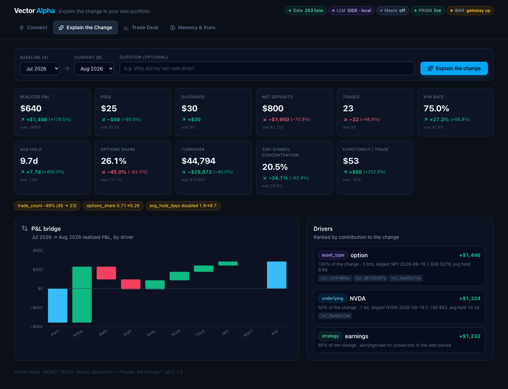
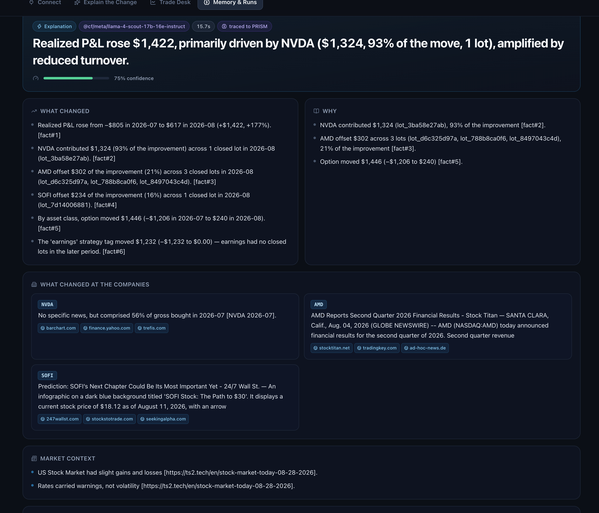
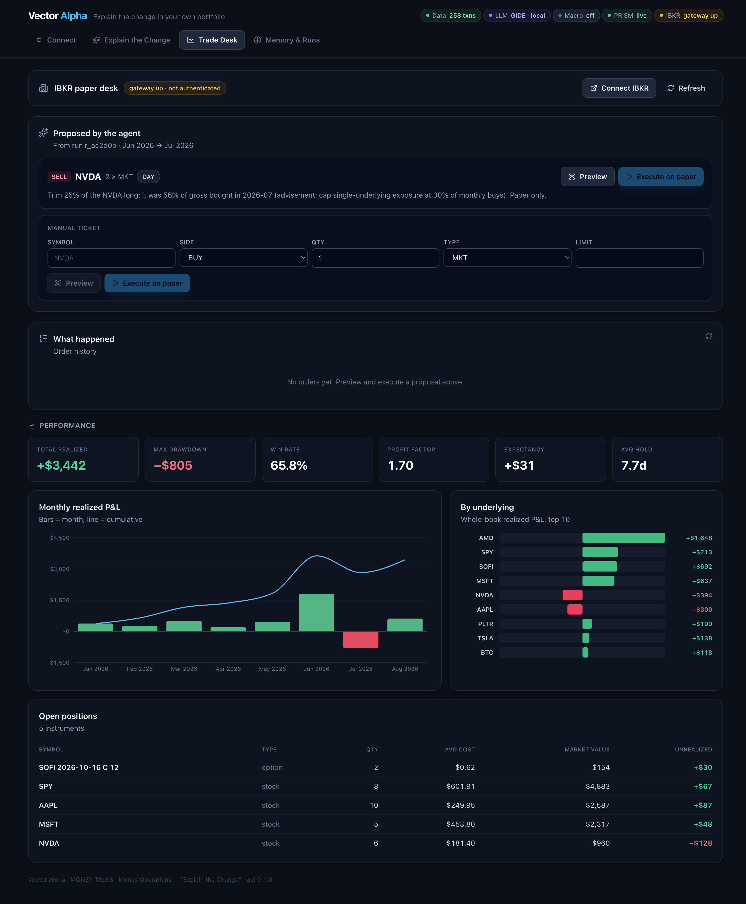

# Vector Alpha — *Explain the change in your own portfolio*

> MONEY TALKS · AI × Finance Hackathon · New York · September 5, 2026
> Track: **Money Operations (Maximor) — "Explain the Change"**

Connect your own brokerage history (Robinhood, Interactive Brokers), and an agent tells you
**what changed, why it changed, and what is driving it** between any two periods — with every
claim tied to the actual trades — then turns that into concrete advisements, remembers them,
checks next month whether you followed them, and can act on them with **paper trades on IBKR**.

```
Realized P&L fell from $1,820 to −$320 (−$2,140).
  → 71% of the decline came from three NVDA calls opened the week before earnings (lot_9f21, lot_a3c0, lot_b77e).
  → You traded 85% more, held 2.3 days instead of 9.4, and NVDA became 58% of what you bought.
  → Fees rose 48% on 72% more turnover.
Advisement: no new option opens within 5 trading days of earnings; cap any single name at 30% of monthly buys.
```



## Problem statement

Finance teams get asked "why did this number move?" every month. The Maximor challenge asks for
an agent that takes **monthly summaries + transaction-level data**, compares periods, finds the
**meaningful** variances, drills into the transactions that drive them, explains with evidence,
and **gets smarter across runs**. Retail traders have exactly this problem with their own P&L:
the broker app shows a green or red number and nothing else.

## Solution

A period-over-period **variance engine** over normalized broker transactions, wrapped in an
**agent loop** whose every step (tool calls, drill-downs, web research, model call) is traced to
**PRISM**. The output is a structured *Report*: headline → what changed → why → drivers with
contribution % and evidence ids → market context → behaviour → advisements → proposed paper trades
→ review of the previous run's advisements.



## Key features

- **Connect your history**: Robinhood account-activity CSV, IBKR Flex Query, live IBKR Client
  Portal sync (positions + recent trades), Robinhood live sync, or a synthetic demo book.
- **Explain the change**: FIFO lot matching → monthly `PeriodSummary` (P&L, fees, dividends,
  deposits, win rate, hold time, options share, concentration) → `VarianceReport` with ranked
  drivers, contribution %, P&L bridge (waterfall), and machine-generated evidence *facts*.
- **Agent reasoning** on any OpenAI-compatible model: Cloudflare Workers AI (Llama 4 Scout, ~5 s)
  or GIDE's local Ornith 1.5 9B (offline). No Anthropic/OpenAI keys anywhere. With no model
  configured it still produces the full report deterministically from the facts.
- **Market context** via Tavily: index moves, VIX, Fed/rates and driver-specific news for the
  period, so "why" covers the regime, not just your own behaviour.
- **Memory across runs**: advisements and company context are saved as insights; the next run
  reviews each one (*followed / ignored / validated / invalidated*) against the new period's numbers.
  Demo: June→July writes "cap NVDA at 30% of buys, hold ≥5 days, cut turnover"; July→August marks
  them **validated** because August traded 41% less, held 11 days and cut NVDA.
- **Act, safely**: proposed trades → IBKR *whatIf* preview → place on the **paper** account.
  A guard refuses any account id that is not `DU…`/`DF…`.
- **Observe → Improve → Prove**: every run is one PRISM trajectory (`session_id = run_id`),
  with tool steps, latency and the model call; the UI shows PRISM's live status.



## Tech stack used

| Layer | Tech |
|---|---|
| Backend | Python 3.14 · FastAPI · pandas · SQLite · SSE streaming |
| Agent | OpenAI-compatible chat: **Cloudflare Workers AI** (Llama 4 Scout) or **GIDE** local Ornith 1.5 · strict-JSON narrative · deterministic fallback |
| Observability | **PRISM** (`prismtrace-sdk`): `trace_llm` + `submit_trajectory` per run |
| Research | **Tavily** news search (macro regime + driver-specific evidence) |
| Brokers | IBKR Client Portal Web API (local gateway, paper) · IBKR Flex Web Service · robin_stocks |
| Frontend | Vite · React · TypeScript · Tailwind · recharts |
| Dev | **GIDE** (local-first AI IDE) · Prelint PR review · uv · pnpm |

## How it works

```
 Robinhood CSV ─┐                                   ┌─ recall prior insights
 IBKR Flex CSV ─┤   normalize    FIFO lots   monthly │  compare periods → ranked drivers
 IBKR live sync ┼──► transactions ──► lots ──► summaries ──► drill into lots per driver ──► LLM (JSON) ──► Report
 Robinhood live ┤                                   │  Tavily: market context + driver news        │
 Synthetic book ┘                                   └─ every step → PRISM trajectory               ▼
                                                                          advisements → insights memory
                                                                          proposed trades → IBKR paper (whatIf → place)
```

1. **Ingest** → `transactions` table (signed cash flows; options as `NVDA 2026-07-18 C 150`).
2. **Ledger** → FIFO closed lots with realized P&L, fees and hold time.
3. **Periods** → per-month summaries; **Variance** → topline deltas, drivers by underlying /
   asset type / strategy / weekday, contribution %, bridge, facts, behaviour flags.
4. **Agent run** (`POST /api/analyze`) → SSE stream of tool steps → structured `Report`.
5. **Memory** → advisements saved; next run reviews them.
6. **Act** → `POST /api/brokers/ibkr/orders/preview` → `.../place` (paper only).

## How to run / use it — one command

```bash
git clone https://github.com/NicholasSutin/vector-alpha && cd vector-alpha
cp .env.example .env            # fill what you have (all optional)
./scripts/hackathon-demo.sh     # = `cd frontend && pnpm run hackathon-demo`
```

That starts the GIDE local model server, the IBKR paper gateway (if present), builds and serves the
UI + API on http://localhost:8000, loads the demo book if the database is empty, and opens the
app, the IBKR login page and the PRISM dashboard in your browser. Over SSH it prints the
`ssh -L` port-forward line instead. Ctrl-C stops everything.

Then in the UI: **Explain the Change → "Explain the change"**, and **Trade Desk** to execute the
agent's proposed paper trades and watch fills, P&L since fill, and performance.

The 90-second walkthrough is in [docs/DEMO.md](docs/DEMO.md). Dev mode with hot reload: `./scripts/dev.sh` (UI :5173, API :8000). Shell-only smoke demo:
`./scripts/demo.sh`.

Tests: `cd backend && .venv/bin/python -m pytest -q`

### Configuration (`.env`)

| Var | Purpose |
|---|---|
| `LLM_BASE_URL`, `LLM_MODEL`, `LLM_API_KEY` | any OpenAI-compatible endpoint. **Cloudflare Workers AI**: `https://api.cloudflare.com/client/v4/accounts/<ACCOUNT_ID>/ai/v1` + `@cf/meta/llama-4-scout-17b-16e-instruct` + an API token. **GIDE**: `http://127.0.0.1:41337/v1` + `local` + `sk-gide-…`. Blank = deterministic mode |
| `TAVILY_API_KEY` | market/macro context and driver news |
| `PRISMTRACE_API_KEY`, `PRISMTRACE_PROJECT_ID`, `PRISMTRACE_HOST` | PRISM tracing |
| `IBKR_GATEWAY_URL` (default `https://localhost:5001/v1/api`), `IBKR_ACCOUNT_ID` | Client Portal Gateway (paper) |
| `IBKR_FLEX_TOKEN`, `IBKR_FLEX_QUERY_ID` | longer IBKR trade history |

### Connecting real accounts

- **Robinhood (no login needed)**: app → *Account → Reports and statements → Account activity
  report* → download CSV → upload in **Connect**.
- **IBKR paper**: `./scripts/ibkr-gateway.sh` starts the Client Portal Gateway on `:5001`
  (macOS uses 5000 for AirPlay). Open `https://localhost:5001`, log in with the **paper**
  username (`DU…`). Over SSH: `ssh -L 5001:localhost:5001 user@host` and log in from your own
  browser. Then **Connect → IBKR → Sync**. For >7 days of history create a Flex token + Activity
  Flex Query (Trades section, CSV) in Client Portal and paste them in the Flex form.
- **Robinhood live**: **Connect → Robinhood live**; if Robinhood asks for device approval,
  approve in the app and press *Retry*. (Unofficial API; CSV is the reliable path.)

## Sponsor tools

- **PRISM** — required, and central: one trajectory per run with each tool step
  (`recall_insights`, `compare_periods`, `drill_down`, `macro_context`, `llm_reason`) and a
  `trace_llm` for the model call. The **Memory & Runs** tab shows PRISM's setup-doctor status.
- **Cloudflare Workers AI** — the default reasoning endpoint (OpenAI-compatible `/ai/v1`,
  Llama 4 Scout); swap models with `LLM_MODEL`.
- **GIDE** — the app was built with GIDE, and GIDE's local OpenAI-compatible API is the offline
  model endpoint (same code path, tighter output budget for the 9B model):
  ```bash
  curl -fsSL https://generativeide.com/install.sh | sh     # CLI → ~/.local/bin/gide
  gide models pull ornith-1.5-9b                            # 6.2 GB local model (Apple Silicon)
  gide server start && gide apikey create vector-alpha      # prints base URL + sk-gide-… key
  # .env:  LLM_BASE_URL=http://127.0.0.1:41337/v1  LLM_MODEL=local  LLM_API_KEY=sk-gide-…
  ```
  GIDE's endpoint has no tool-calling or JSON mode, so the agent asks for strict JSON and
  validates it against the `Report` schema (and falls back to the deterministic narrative).
- **Tavily** — `macro_context` and driver-specific news steps; sources are cited in the report.
- **Prelint** — PR reviews on this repository.

## Safety

- Paper-trading only. `backend/app/brokers/guard.py` refuses any non-`DU`/`DF` account for
  preview/place/cancel. Nothing in this repo can place a live order.
- No secrets in git. `.env` is ignored; `.env.example` holds names only.
- Robinhood credentials are used only for the session and never stored in the database.

## Repository layout

```
backend/app/ingest/       CSV parsers (Robinhood activity, IBKR Flex/Activity), synthetic book
backend/app/analytics/    ledger (FIFO), periods, variance, positions, service facade
backend/app/agent/        runner (traced loop), prompts, fallback, memory, events
backend/app/integrations/ prism, tavily, llm (OpenAI-compatible)
backend/app/brokers/      ibkr (gateway), ibkr_flex, robinhood, guard
backend/app/routes/       ingest, analytics, agent, brokers
frontend/                 Vite + React UI (Connect · Explain the Change · Memory & Runs)
docs/                     ARCHITECTURE.md, API.md
scripts/                  hackathon-demo.sh (one-command demo), dev.sh, build.sh, demo.sh, ibkr-gateway.sh, pack-usb.sh
```
